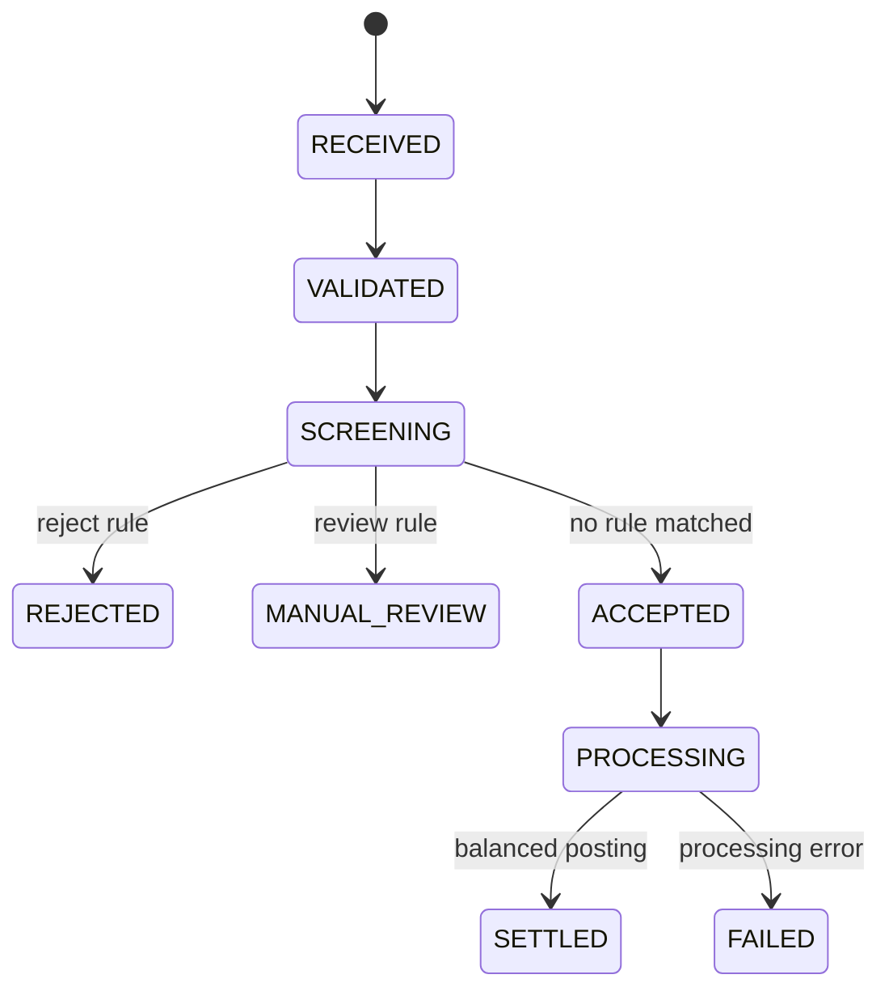
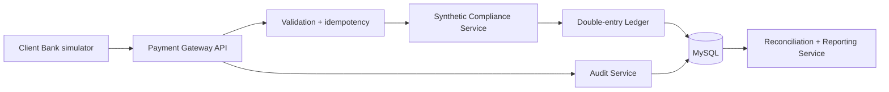

# BankBridge

[](https://github.com/Jeffhan789/BankBridge/actions/workflows/ci.yml)
[](https://openjdk.org/projects/jdk/21/)
[](https://spring.io/projects/spring-boot)
[](LICENSE)

**A cross-border payment, reconciliation, and compliance-processing sandbox for backend engineering practice.**

BankBridge models how a payment instruction moves from intake to validation, synthetic compliance screening, double-entry posting, settlement, reconciliation, and reporting. It focuses on the engineering work behind reliable financial integrations: state transitions, idempotency, batch isolation, auditable decisions, database migrations, API contracts, and automated tests.

> **Independent educational project.** This sandbox uses synthetic data only. It is not affiliated with any bank, payment network, regulator, or financial technology company. It does not connect to real financial infrastructure or implement an official regulatory message format.

## What the project demonstrates

- Java 21 and Spring Boot API design
- MySQL persistence with Flyway migrations
- duplicate-message protection through a unique business key
- configurable synthetic reject and manual-review rules
- balanced debit and credit postings for settled payments
- isolated CSV batch failures
- daily reconciliation and generic compliance summaries
- immutable status history and searchable audit events
- OpenAPI documentation, Docker packaging, and CI

## Payment lifecycle



## Architecture



Version `0.1.0` keeps processing synchronous and deterministic so the complete transaction can be inspected and tested. The next milestone replaces the processing boundary with RabbitMQ, retries, and dead-letter handling.

## Quick start

Requirements: Docker with Docker Compose.

```bash
docker compose up --build
```

Then open:

- Swagger UI: <http://localhost:8080/swagger-ui>
- OpenAPI JSON: <http://localhost:8080/api-docs>
- Health check: <http://localhost:8080/health>

Local Java workflow:

```bash
mvn test
mvn spring-boot:run
```

## Three-minute demo

### 1. Successful settlement

```bash
curl -X POST http://localhost:8080/api/payments \
  -H 'Content-Type: application/json' \
  --data @samples/payment-accepted.json
```

Expected result: `SETTLED`, six status events, and one debit plus one equal credit entry.

### 2. Synthetic compliance rejection

```bash
curl -X POST http://localhost:8080/api/payments \
  -H 'Content-Type: application/json' \
  --data @samples/payment-rejected.json
```

Expected result: `REJECTED` with no ledger entries.

### 3. Duplicate protection

Run the first command again. The API returns HTTP `409 Conflict` because `messageId` is idempotent.

### Batch processing and reconciliation

```bash
curl -X POST http://localhost:8080/api/payment-batches \
  -F 'file=@samples/payment-batch.csv'

curl 'http://localhost:8080/api/reconciliation/daily'
curl 'http://localhost:8080/api/compliance-reports/daily'
```

## API surface

| Method | Endpoint | Purpose |
|---|---|---|
| `POST` | `/api/payments` | Submit a synthetic payment instruction |
| `GET` | `/api/payments/{id}` | Read state, history, screening, and ledger entries |
| `POST` | `/api/payment-batches` | Upload the documented CSV format |
| `GET` | `/api/payment-batches/{id}` | Inspect batch counts and row errors |
| `GET` | `/api/reconciliation/daily` | Compare daily debit and credit totals |
| `GET` | `/api/compliance-reports/daily` | Return generic status and currency totals |
| `GET` | `/api/audit-events` | Read the latest audit events or filter by aggregate |
| `POST` | `/api/screening-rules` | Add a synthetic screening rule |
| `GET` | `/api/screening-rules` | List configured rules |

## Documentation

- [System design](docs/system-design.md)
- [Interface specification](docs/interface-specification.md)
- [Batch processing flow](docs/batch-processing-flow.md)
- [Data dictionary](docs/data-dictionary.md)
- [Security boundaries](docs/security-boundaries.md)
- [Test scenarios](docs/test-scenarios.md)
- [English client walkthrough](docs/client-walkthrough-en.md)

## 中文简介

BankBridge 是一个使用合成数据构建的跨境支付与合规处理教学沙盒。项目用 Java、Spring Boot 和 MySQL 展示支付状态流转、幂等控制、模拟规则检查、复式记账、批量处理、日终对账和审计日志。它不连接任何真实银行或支付网络，也不实现正式监管报文。

该项目适合用于 Java 后端、金融科技、测试开发、系统实施、解决方案和英文技术交付岗位的作品展示。

## Roadmap

- `v0.2`: RabbitMQ processing, retries, timeouts, and dead-letter queues
- `v0.3`: authentication, role-based access, and report export
- `v0.4`: lightweight operations dashboard and observability
- `v1.0`: deployment guide, performance evidence, and recorded demo

## License

[MIT](LICENSE)
