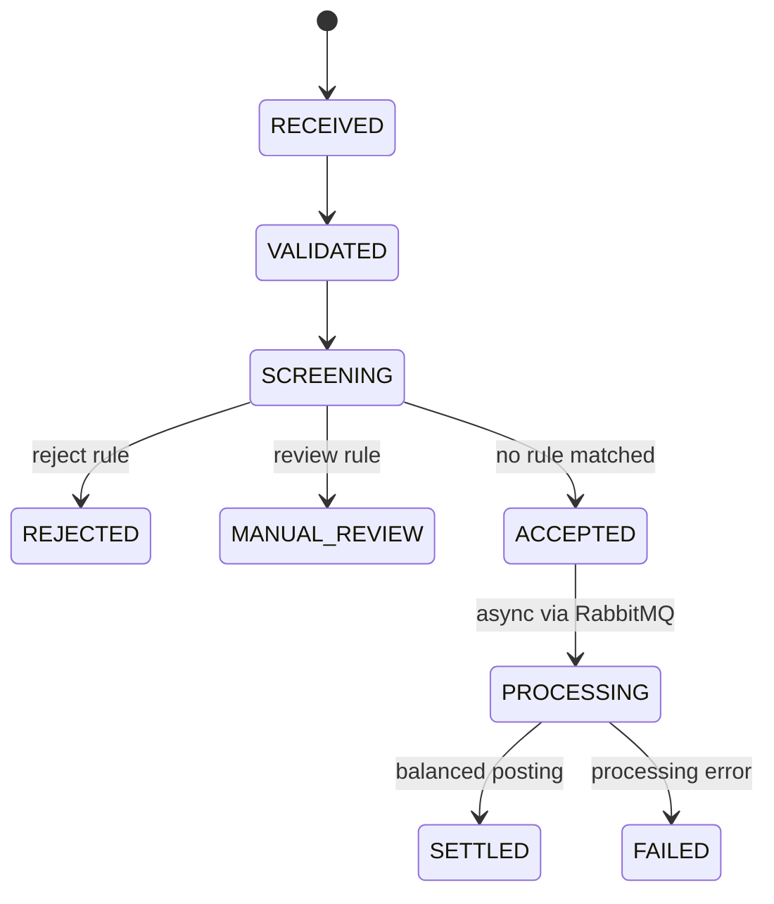
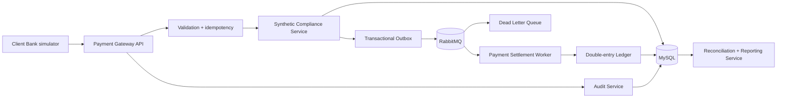
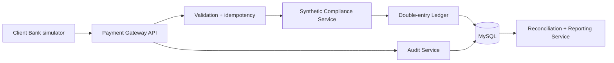

# BankBridge（汇桥）

> English first. 中文版见后文。

[English](#english-overview) | [中文](#中文项目介绍)

[](https://github.com/Jeffhan789/BankBridge/actions/workflows/ci.yml)
[](https://openjdk.org/projects/jdk/21/)
[](https://spring.io/projects/spring-boot)
[](LICENSE)

**A cross-border payment, reconciliation, and compliance-processing sandbox for backend engineering practice.**

BankBridge（汇桥）models how a payment instruction moves from intake to validation, synthetic compliance screening, double-entry posting, settlement, reconciliation, and reporting. It focuses on the engineering work behind reliable financial integrations: state transitions, idempotency, batch isolation, auditable decisions, database migrations, API contracts, and automated tests.

> **Independent educational project.** This sandbox uses synthetic data only. It is not affiliated with any bank, payment network, regulator, or financial technology company. It does not connect to real financial infrastructure or implement an official regulatory message format.

## English Overview

BankBridge（汇桥）is a portfolio-ready backend engineering project that models a complete synthetic payment-processing lifecycle. It is designed to demonstrate reliable service design rather than a simple CRUD application: requests move through validation, synthetic compliance screening, double-entry posting, settlement, reconciliation, reporting, and auditable state history.

The current `v0.2.0` implementation introduces asynchronous settlement through RabbitMQ, transactional outbox, idempotent consumers, exponential-backoff retries, and dead-letter recovery. The synchronous validation and screening boundary remains deterministic so the API contract and tests are stable.

## What the project demonstrates

- Java 21 and Spring Boot API design
- MySQL persistence with Flyway migrations
- **RabbitMQ** with transactional outbox, idempotent consumers, and dead-letter recovery
- exponential-backoff retries with configurable max attempts
- duplicate-message protection through a unique business key
- configurable synthetic reject and manual-review rules
- balanced debit and credit postings for settled payments
- isolated CSV batch failures
- daily reconciliation and generic compliance summaries
- immutable status history and searchable audit events
- OpenAPI documentation, Docker packaging, and CI

## Payment lifecycle



## Architecture



Version `0.2.0` splits processing at `ACCEPTED`: validation and screening remain synchronous and deterministic; settlement runs asynchronously through RabbitMQ with retries and dead-letter recovery.



Version `0.1.0` keeps processing synchronous and deterministic so the complete transaction can be inspected and tested. The next milestone replaces the processing boundary with RabbitMQ, retries, and dead-letter handling.

## Quick start

Requirements: Docker with Docker Compose.

```bash
docker compose up --build
```

Then open:

- Swagger UI: <http://localhost:8080/swagger-ui>
- OpenAPI JSON: <http://localhost:8080/api-docs>
- Health check: <http://localhost:8080/health>

Local Java workflow:

```bash
mvn test
mvn spring-boot:run
```

## Three-minute demo

### 1. Successful settlement (async)

```bash
curl -X POST http://localhost:8080/api/payments \
  -H 'Content-Type: application/json' \
  --data @samples/payment-accepted.json
```

Expected result: `ACCEPTED`, four status events, and an empty ledger. The payment is queued for asynchronous settlement via RabbitMQ.

Poll the payment to see the final `SETTLED` state:

```bash
# Replace {id} with the payment id from the response above
curl http://localhost:8080/api/payments/{id}
```

Once settled, the response shows six status events and one debit plus one equal credit entry.

### 2. Synthetic compliance rejection

```bash
curl -X POST http://localhost:8080/api/payments \
  -H 'Content-Type: application/json' \
  --data @samples/payment-rejected.json
```

Expected result: `REJECTED` with no ledger entries (rejected payments never enter the async flow).

### 3. Duplicate protection

Run the first command again. The API returns HTTP `409 Conflict` because `messageId` is idempotent.

### Batch processing and reconciliation

```bash
curl -X POST http://localhost:8080/api/payment-batches \
  -F 'file=@samples/payment-batch.csv'

curl 'http://localhost:8080/api/reconciliation/daily'
curl 'http://localhost:8080/api/compliance-reports/daily'
```

## API surface

| Method | Endpoint | Purpose |
|---|---|---|
| `POST` | `/api/payments` | Submit a synthetic payment instruction (returns `ACCEPTED` for async settlement) |
| `GET` | `/api/payments/{id}` | Read state, history, screening, and ledger entries |
| `POST` | `/api/payment-batches` | Upload the documented CSV format |
| `GET` | `/api/payment-batches/{id}` | Inspect batch counts and row errors |
| `GET` | `/api/reconciliation/daily` | Compare daily debit and credit totals |
| `GET` | `/api/compliance-reports/daily` | Return generic status and currency totals |
| `GET` | `/api/audit-events` | Read the latest audit events or filter by aggregate |
| `POST` | `/api/screening-rules` | Add a synthetic screening rule |
| `GET` | `/api/screening-rules` | List configured rules |
| `GET` | `/api/dead-letters` | Inspect the dead-letter queue message count |
| `POST` | `/api/dead-letters/replay` | Replay dead-letter messages back to the settlement queue |

## Documentation

- [System design](docs/system-design.md)
- [Interface specification](docs/interface-specification.md)
- [Batch processing flow](docs/batch-processing-flow.md)
- [Data dictionary](docs/data-dictionary.md)
- [Security boundaries](docs/security-boundaries.md)
- [Test scenarios](docs/test-scenarios.md)
- [English client walkthrough](docs/client-walkthrough-en.md)
- [中文详细路线图](docs/roadmap-zh.md)

## 中文项目介绍

BankBridge（汇桥）是一个面向后端工程实践和求职展示的跨境支付、对账与模拟合规处理沙盒。项目使用 Java 21、Spring Boot、MySQL、Flyway、Docker 和自动化测试，完整建模一笔合成支付指令从接收、校验、规则筛查、复式记账、结算到日终对账与审计追踪的处理过程。

项目重点不在普通 CRUD 页面，而在可靠后端系统中的关键工程问题：

- 使用唯一业务键实现重复请求保护与幂等控制。
- 使用明确状态机记录支付生命周期和不可变状态历史。
- **使用 RabbitMQ 和事务型 Outbox 实现异步结算，确保数据库提交与消息发送的一致性。**
- **使用幂等消费者避免重复扣款，指数退避重试和死信队列处理暂时故障。**
- 使用金额相等的借方与贷方分录验证复式记账平衡。
- 对 CSV 批量任务进行逐行错误隔离，避免单条失败影响整批处理。
- 使用 Flyway 管理数据库版本，并通过 OpenAPI、Docker 和 GitHub Actions 提供可复现的开发与验证流程。
- 使用合成数据和模拟规则控制安全边界，不连接真实银行、支付网络或监管基础设施。

当前 `v0.2.0` 已引入 RabbitMQ 异步结算链路。提交接口在验证与筛查后快速返回 `ACCEPTED`，后台通过事务型 Outbox 发布到 RabbitMQ，由消费端完成复式记账与状态推进。

该项目适合用于 Java 后端、金融科技、测试开发、系统实施、解决方案和英文技术交付岗位的作品展示。

### 三分钟演示

```bash
docker compose up --build
```

服务启动后可访问：

- Swagger UI：<http://localhost:8080/swagger-ui>
- OpenAPI JSON：<http://localhost:8080/api-docs>
- 健康检查：<http://localhost:8080/health>

建议依次演示成功结算、模拟合规拒绝和重复请求冲突三条路径。对应请求样例位于 `samples/`，完整命令见上方英文演示章节。

## Roadmap

- `v0.2`: RabbitMQ, transactional outbox, idempotent consumers, retries, and dead-letter recovery ✅
- `v0.3`: authentication, role-based access, searchable audit data, and report export
- `v0.4`: lightweight operations dashboard, structured logs, metrics, and Grafana
- `v0.5`: performance baselines, resilience tests, deployment, and supply-chain checks
- `v1.0`: stable API, bilingual portfolio documentation, reproducible demo, and recorded walkthrough

The detailed milestones, test requirements, deliverables, acceptance criteria, and suggested ten-week schedule are documented in the [Chinese project roadmap](docs/roadmap-zh.md).

## License

[MIT](LICENSE)
