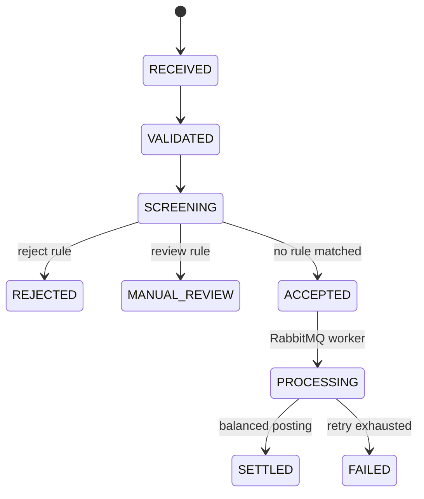
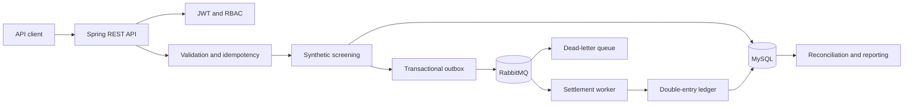

# BankBridge（汇桥）

[](https://github.com/Jeffhan789/BankBridge/actions/workflows/ci.yml)
[](https://github.com/Jeffhan789/BankBridge/releases)
[](https://openjdk.org/projects/jdk/21/)
[](https://spring.io/projects/spring-boot)
[](LICENSE)

BankBridge is a backend sandbox that models a synthetic cross-border payment lifecycle: validation, screening, asynchronous settlement, double-entry posting, reconciliation, and audit. It focuses on reliability boundaries that are usually missing from CRUD examples.

中文说明见[下文](#中文说明)。

> Independent educational project. All data and screening rules are synthetic. BankBridge is not affiliated with a bank, payment network, regulator, or financial technology company, and it must not be used for real funds.

## What is implemented

- Java 21 and Spring Boot 3.4 REST API.
- JWT authentication and RBAC for OPERATOR, COMPLIANCE_ANALYST, AUDITOR, and ADMIN roles.
- MySQL persistence with versioned Flyway migrations.
- RabbitMQ settlement with transactional outbox, idempotent consumers, retry, and dead-letter recovery.
- Explicit payment state transitions and immutable status history.
- Synthetic reject and manual-review rules.
- Balanced debit and credit postings for settled payments.
- CSV batch processing with per-row failure isolation.
- Daily reconciliation, reporting, masked fields, and searchable audit events.
- OpenAPI documentation, Docker Compose, and automated integration tests.

## Payment lifecycle



## Architecture



## Quick start

Requirements: Docker and Docker Compose.

```bash
docker compose up --build
```

Then open:

- Swagger UI: <http://localhost:8080/swagger-ui>
- OpenAPI JSON: <http://localhost:8080/api-docs>
- Health check: <http://localhost:8080/health>

Local verification:

```bash
mvn test
mvn spring-boot:run
```

## Authentication

Request a token through `POST /api/auth/login`, then pass it as a Bearer token. Demo credentials are defined only for the synthetic local environment; change them before any shared deployment.

```bash
curl -X POST http://localhost:8080/api/auth/login \
  -H 'Content-Type: application/json' \
  -d '{"username":"operator001","password":"operator001"}'
```

## Reproducible scenarios

Submit the files in `samples/` to verify accepted, rejected, duplicate, and mixed-batch paths:

```bash
TOKEN='<token from /api/auth/login>'

curl -X POST http://localhost:8080/api/payments \
  -H "Authorization: Bearer $TOKEN" \
  -H 'Content-Type: application/json' \
  --data @samples/payment-accepted.json

curl -X POST http://localhost:8080/api/payment-batches \
  -H "Authorization: Bearer $TOKEN" \
  -F 'file=@samples/payment-batch.csv'
```

The first request returns `ACCEPTED`; the worker later advances it to `SETTLED`. Repeating the same message produces `409 Conflict` and does not create duplicate ledger entries.

## API groups

| Group | Examples | Access |
| --- | --- | --- |
| Authentication | `/api/auth/login`, `/api/auth/me` | Public login; authenticated profile |
| Payments | `/api/payments`, `/api/payments/{id}` | OPERATOR, ADMIN |
| Batches | `/api/payment-batches` | OPERATOR, ADMIN |
| Reconciliation and reports | `/api/reconciliation/daily`, `/api/compliance-reports/daily` | AUDITOR, ADMIN |
| Audit | `/api/audit-events` | COMPLIANCE_ANALYST, AUDITOR, ADMIN |
| Rules and recovery | `/api/screening-rules`, `/api/dead-letters/replay` | ADMIN |

The generated OpenAPI document is the source of truth for request and response fields.

## Safety boundaries

- No real customer, account, sanctions, or transaction data.
- No connection to real banking or payment infrastructure.
- Synthetic screening demonstrates workflow behaviour, not regulatory compliance.
- Secrets for nonlocal environments must come from environment variables or a secret manager.
- See [SECURITY.md](SECURITY.md) for responsible disclosure.

## Documentation

- [System design](docs/system-design.md)
- [Interface specification](docs/interface-specification.md)
- [Batch processing flow](docs/batch-processing-flow.md)
- [Security boundaries](docs/security-boundaries.md)
- [Test scenarios](docs/test-scenarios.md)
- [架构设计指南](架构设计指南.md)
- [中文路线图](docs/roadmap-zh.md)

## 中文说明

BankBridge（汇桥）是一个跨境支付后端沙盒，用合成数据完整演示支付指令从接收、校验、规则筛查、异步结算、复式记账到日终对账与审计的生命周期。

项目重点不是普通 CRUD，而是可靠系统的工程边界：事务型 Outbox、幂等消费、指数退避与死信恢复、状态机、借贷平衡、批处理错误隔离、权限矩阵、字段脱敏、数据库迁移和可复现测试。

当前实现仅用于教育与工程研究，不连接任何真实银行、支付网络或监管基础设施，也不代表正式合规方案。

## Roadmap

- `v0.4`: operations dashboard, structured logs, metrics, and Grafana.
- `v0.5`: performance baselines, resilience tests, deployment, and supply-chain checks.
- `v1.0`: stable API, reproducible demo data, ADRs, and release documentation.

Detailed acceptance criteria are tracked in the [Chinese roadmap](docs/roadmap-zh.md).

## License

[MIT](LICENSE)
