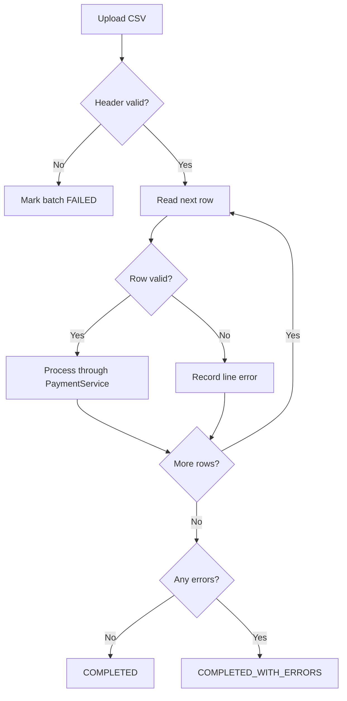

# Batch Processing Flow

## Input contract

The endpoint accepts one UTF-8 CSV file up to 2 MB. The header must exactly match the interface specification. Every nonblank row is treated as one payment instruction.

## Processing

Successful rows remain committed when another row fails. The response reports total, successful, and failed record counts plus a line-numbered error summary.

## Failure policy

- Invalid file or header: fail the complete batch.
- Invalid row: isolate the row and continue.
- Duplicate `messageId`: record the row as failed.
- Screening rejection: the row is technically processed successfully because the payment reached a valid business decision.
- Unexpected input/output error: mark the batch failed and return `400`.

`v0.2` will move large batches to background workers and add downloadable result files.
