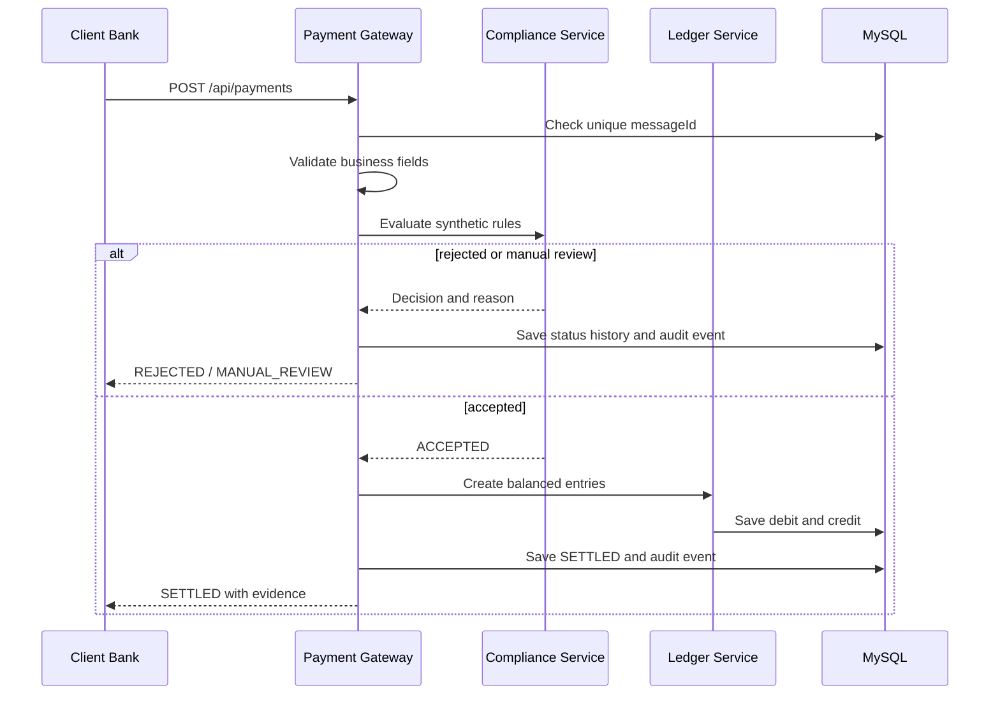

# System Design

## Purpose

BankBridge（汇桥）is an independent educational sandbox for studying the backend workflow behind cross-border payment integration. It uses synthetic actors and data and intentionally stops before any real network, official message format, or regulated workflow.

## Components

- **Client Bank simulator** submits JSON or CSV payment instructions.
- **Payment Gateway API** exposes validation, query, batch, rule, audit, reconciliation, and reporting endpoints.
- **Validation and idempotency** enforce required fields, positive amounts, execution dates, account separation, and unique `messageId` values.
- **Synthetic Compliance Service** evaluates configurable exact-match rules. Reject rules take priority over manual-review rules.
- **Ledger Service** creates equal debit and credit entries only for accepted payments.
- **Reporting Service** summarizes daily payment states and verifies ledger balance.
- **Audit Service** records state transitions, rule creation, and ledger posting without storing credentials.

## Settlement sequence

## Transaction and consistency choices

- Single-payment processing runs in one database transaction in `v0.1.0`.
- The database unique constraint is the final protection against concurrent duplicate `messageId` values.
- A rejected or manual-review payment never creates ledger entries.
- Ledger entries are checked before persistence so debit and credit totals must be equal.
- Batch rows call the same payment service independently, allowing one row to fail without discarding successful rows.

## Evolution boundary

The transition from `ACCEPTED` to `PROCESSING` is the future asynchronous boundary. `v0.2` will publish a synthetic settlement command to RabbitMQ, add retry and dead-letter handling, and keep the public API contract stable.
